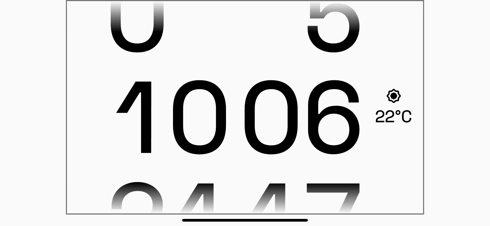
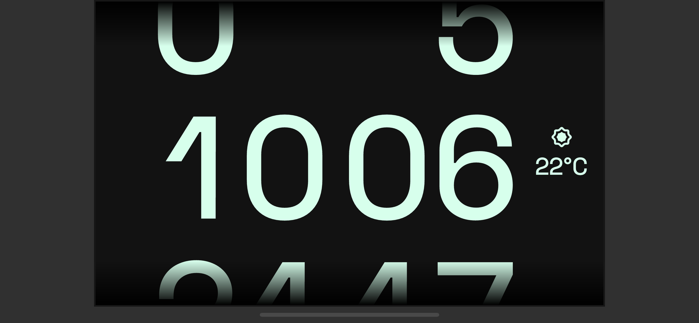

# Flutter digital clock

Designed by [@tommy_emo](https://twitter.com/tommy_emo_)

## Build

```
flutter channel stable
```
```
flutter upgrade
```
```
cd digital_clock
```
```
flutter create .
```
```
flutter run (on Android or iOS in landscape)
```

## Screenshots



